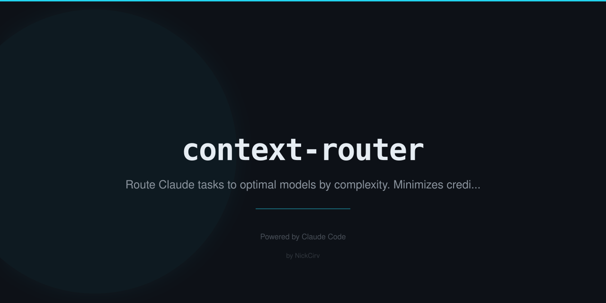

# context-router

Smart Claude model selector. Describe your task — it picks Haiku, Sonnet, or Opus based on complexity signals, explains why, and estimates the cost. Stop burning Opus credits on tasks Haiku handles fine.

## Install

```bash
npx context-router "your task"
```

Or install globally:

```bash
npm install -g context-router
```

## Usage

```bash
# Route a task — see the model decision and cost estimate
npx context-router "implement user authentication with JWT"

# Route AND call the selected model, stream response
npx context-router "fix typo in variable name" --run

# Show cost log (last 20 entries + running total)
npx context-router --log

# Weekly and monthly spend breakdown
npx context-router --stats

# Interactive calibration quiz — tune thresholds to your workflow
npx context-router --calibrate

# Clear the cost log
npx context-router --reset-log
```

## Example Output

```
🧭 Context Router
────────────────────────────────────────
Task: "implement user authentication with JWT"

Analysis:
  Signals: sonnet (+6): implement, authentication, jwt | haiku (+1): check
  Confidence: 72% → Sonnet
  Tokens est: ~65 input, ~32 output

Routing Decision: ✓ SONNET
  Why: Implementation task with moderate complexity — Sonnet is the sweet spot
  Model ID: claude-sonnet-4-5

Cost Estimate:
  Haiku    $0.0001   ⚡ Fast & cheap — best for simple tasks
  Sonnet   $0.0004   ← selected
  Opus     $0.0020   ★ Maximum intelligence — best for complex reasoning

Savings vs Opus: $0.0016 (80% cheaper) 💰

Run with Sonnet? (y/n/h for haiku/s for sonnet/o for opus):
```

## Cost Comparison

| Model | Input (per 1K) | Output (per 1K) | Best For |
|-------|---------------|-----------------|----------|
| Haiku | $0.001 | $0.001 | Simple tasks, lookups, formatting, yes/no |
| Sonnet | $0.003 | $0.015 | Implementation, review, debugging, most code |
| Opus | $0.015 | $0.075 | Architecture, security audits, complex trade-offs |

**Real-world savings example:**
- 100 "fix typo" tasks: Haiku = $0.10 vs Opus = $1.50 → save $1.40
- 50 "implement feature" tasks: Sonnet = $0.75 vs Opus = $7.50 → save $6.75
- 10 "architect system" tasks: Opus = $1.50 → justified

## Routing Logic

The tool uses heuristics (no AI) to classify your task:

**HAIKU** — `simple`, `quick`, `fix`, `rename`, `format`, `list`, `check`, `lookup`, `convert`, `parse`, `trim`, `validate`, `sanitize`, `capitalize`, `sort`, `filter`, `encode`, `decode`, `translate`, `summarize`, `shorten`, `yes or no`, `how do i`, `what does`, `one line`, `single file`, `minor`, `trivial`, `basic` ... and 20+ more

**SONNET** — `implement`, `write`, `create`, `build`, `develop`, `code`, `review`, `explain`, `debug`, `refactor`, `improve`, `optimize`, `analyze`, `test`, `verify`, `integrate`, `configure`, `deploy`, `migrate`, `update`, `fix bug`, `authentication`, `api endpoint`, `database query`, `component`, `middleware` ... and 20+ more

**OPUS** — `architect`, `architecture`, `design system`, `system design`, `schema design`, `strategy`, `roadmap`, `orchestrate`, `trade-off`, `security audit`, `threat model`, `compliance`, `distributed system`, `scalability`, `concurrency`, `microservices`, `event-driven`, `root cause`, `comprehensive`, `full audit` ... and 20+ more

## API Key

Set `ANTHROPIC_API_KEY` in your environment to use `--run` mode:

```bash
export ANTHROPIC_API_KEY=sk-ant-...
```

Without it, the tool still shows the routing decision and cost estimate — useful for dry runs.

## Cost Log

All `--run` calls are logged to `~/.context-router-log.json`:

```json
[
  {
    "date": "2026-03-02T10:00:00.000Z",
    "task": "implement user authentication with JWT",
    "model": "sonnet",
    "inputTokens": 65,
    "outputTokens": 420,
    "cost": 0.0063
  }
]
```

## Calibration

Run `--calibrate` to tune thresholds based on your workflow:

- Mostly simple tasks → boosts Haiku score
- Frequent architectural work → boosts Opus score
- Cost-sensitive → boosts Haiku score

Config saved to `~/.context-router-config.json`.

## Zero Dependencies

Pure Node.js ES modules. Uses only built-in modules: `https`, `fs`, `path`, `os`, `readline`. No `node_modules`, no install step, no lock files.

## License

MIT
