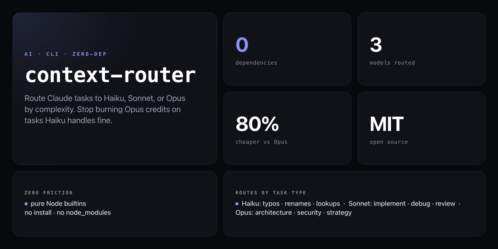

<div align="center">

**Describe your task. Get the right model. Stop over-paying for Opus on tasks Haiku handles fine.**


</div>

---

Running every Claude task through Opus because you can't be bothered to think about it? That's a 15× price multiplier over Haiku on the tasks that don't need it. `context-router` reads your task description, scores it against 80+ complexity signals, picks the right model tier, explains why, and shows you the cost delta — before you commit a single token.

```
🧭 Context Router
────────────────────────────────────────
Task: "implement user authentication with JWT"

Analysis:
  Signals: sonnet (+6): implement, authentication, jwt | haiku (+1): check
  Confidence: 72% → Sonnet
  Tokens est: ~65 input, ~32 output

Routing Decision: ✓ SONNET
  Why: Implementation task with moderate complexity — Sonnet is the sweet spot
  Model ID: claude-sonnet-4-5

Cost Estimate:
  Haiku    $0.0001   ⚡ Fast & cheap — best for simple tasks
  Sonnet   $0.0004   ← selected
  Opus     $0.0020   ★ Maximum intelligence — best for complex reasoning

Savings vs Opus: $0.0016 (80% cheaper) 💰

Run with Sonnet? (y/n/h for haiku/s for sonnet/o for opus):
```

## Install

No npm account, no global install — runs straight from GitHub with zero dependencies:

```bash
npx github:NickCirv/context-router "your task"
```

## Usage

```bash
# Route a task — see model decision + cost estimate
npx github:NickCirv/context-router "implement user authentication with JWT"

# Route AND call the selected model, stream the response
npx github:NickCirv/context-router "fix typo in variable name" --run

# Show cost log (last 20 entries + running total)
npx github:NickCirv/context-router --log

# Weekly and monthly spend breakdown
npx github:NickCirv/context-router --stats

# Interactive calibration quiz — tune thresholds to your workflow
npx github:NickCirv/context-router --calibrate

# Clear the cost log
npx github:NickCirv/context-router --reset-log
```

| Flag | Description |
|------|-------------|
| `--run` | Route + call the selected model, stream response, log actual cost |
| `--log` | Show last 20 logged calls with running total |
| `--stats` | Weekly and monthly spend breakdown by model |
| `--calibrate` | Interactive quiz to tune Haiku/Opus scoring boosts |
| `--reset-log` | Clear `~/.context-router-log.json` |

## Routing logic

No AI involved — pure heuristics against 80+ keyword signals across three tiers:

| Tier | Signal examples | Price range |
|------|----------------|-------------|
| **Haiku** | `fix`, `rename`, `format`, `list`, `check`, `lookup`, `convert`, `parse`, `trim`, `validate`, `sort`, `encode`, `summarize`, `how do i`, `one line`, `trivial` | $0.001/1K in · $0.001/1K out |
| **Sonnet** | `implement`, `write`, `create`, `build`, `debug`, `refactor`, `review`, `optimize`, `test`, `integrate`, `deploy`, `migrate`, `authentication`, `api endpoint`, `middleware` | $0.003/1K in · $0.015/1K out |
| **Opus** | `architect`, `architecture`, `design system`, `strategy`, `roadmap`, `trade-off`, `security audit`, `threat model`, `compliance`, `distributed system`, `scalability`, `concurrency`, `root cause`, `comprehensive`, `full audit` | $0.015/1K in · $0.075/1K out |

Multi-word signals score 2 points; single-word signals score 1 point. Opus wins any tie it participates in (architectural decisions shouldn't be down-graded). Ambiguous ties default to Sonnet as the safe middle tier.

Tune the thresholds with `--calibrate` — answers to three questions persist score boosts to `~/.context-router-config.json`.

## Real-world savings

| Scenario | Haiku | Sonnet | Opus |
|----------|-------|--------|------|
| 100× "fix typo" tasks | **$0.10** | $0.45 | $1.50 |
| 50× "implement feature" tasks | — | **$0.75** | $7.50 |
| 10× "architect system" tasks | — | — | **$1.50** |

Savings compound: a team running 500 tasks/day with mixed complexity can shift 40–60% to Haiku/Sonnet and halve their monthly Anthropic bill without touching model quality on tasks that actually need Opus.

## API key

Set `ANTHROPIC_API_KEY` to use `--run` mode and stream real responses:

```bash
export ANTHROPIC_API_KEY=sk-ant-...
```

Without it, the tool still routes, explains, and estimates cost — useful as a dry-run decision aid before you paste the task into Claude.

## Cost log

Every `--run` call is logged to `~/.context-router-log.json`:

```json
[
  {
    "date": "2026-03-02T10:00:00.000Z",
    "task": "implement user authentication with JWT",
    "model": "sonnet",
    "inputTokens": 65,
    "outputTokens": 420,
    "cost": 0.0063
  }
]
```

`--stats` aggregates this by week and month, broken down by model — so you can see whether your routing mix is drifting toward Opus over time.

## What it is NOT

- **Not a proxy or API wrapper.** It calls the Anthropic API directly using Node's built-in `https` module when `--run` is set. No middleware, no rate-limiting layer, no request transformation.
- **Not a guarantee of quality.** Routing is heuristic. A task with no strong signals defaults to Sonnet. Override interactively with `h`, `s`, or `o` at the prompt, or force a tier with `--run` after accepting the suggestion.
- **Not a cost billing system.** The log tracks estimated + actual token costs locally. It does not connect to your Anthropic billing dashboard or enforce budgets.

---

<div align="center">
<sub>Zero dependencies · Node 18+ · MIT · by <a href="https://github.com/NickCirv">NickCirv</a></sub>
</div>
